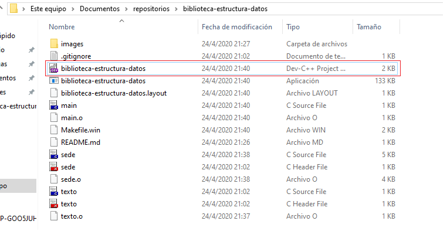
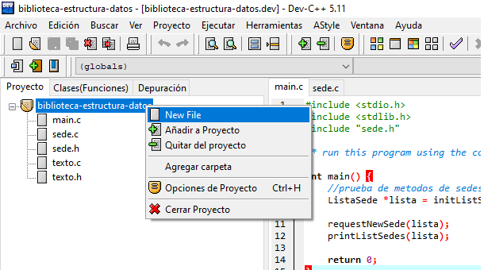
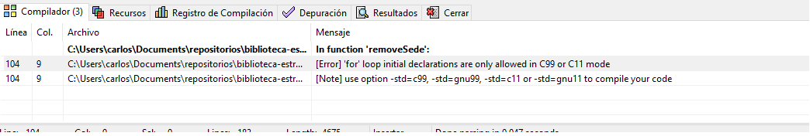
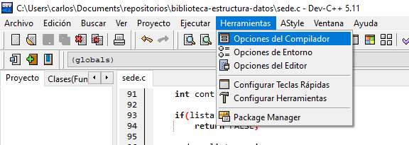

# Manejo de archivos
Para incluir archivos al proyecto, debes abrir **biblioteca-estructura-datos.dev** y esperar que cargue el IDE

Al crear un nuevo archivo, tienes que agregarlo desde la siguiente opción

# Estructura de archivos
Los fuente se componen de un archivo **file.h** el cual contiene las definiciones de los métodos y un **archivo.c** que posee el fuente principal

# Error al compilar la aplicación
Es probable que **dev c++** te muestre el error de la imagen, cuando intentes compilar la aplicación por primera vez

Sigue las instrucciones para solucionar el problema:
1. Haz clic a la opción **Herramientas->Opciones del compilador**

2. Marca la opcion **Añadir los comandos** y escribe `-std=c99` en la caja de texto

