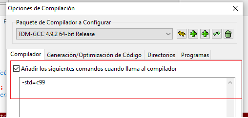

# Manejo de archivos
Para incluir archivos al proyecto, deber abrir **biblioteca-estructura-datos.dev** y esperar que cargue el IDE

Al crear un archivo nuevo, debes hacerlo desde la siguiente opcion

# Estructura de archivos
Los fuente se componen un archivo **file.h** el cual contiene las definiciones de los metodos y un **archivo.c** que posee el fuente principal.

# Error al compilar la aplicación
Es probable que **dev c++** te muestre el error de la imagen, cuando intentes compilar la aplicacion

Sigue las instrucciones para solucionar el problema:
1. Haz clic a la opcion **Herramientas->Opciones del compilador**

2. Marca la opcion **Añadir los comandos** y escribe `-std=c99` en la caja de texto

